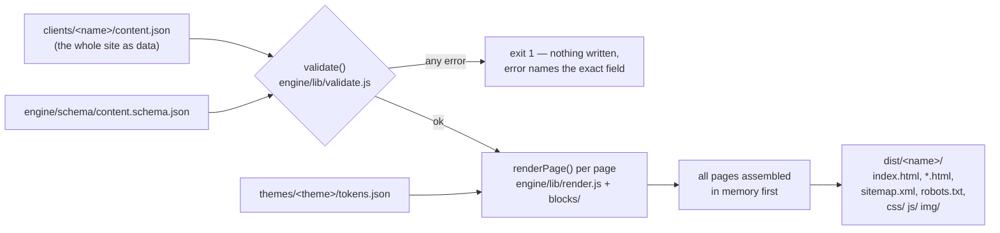
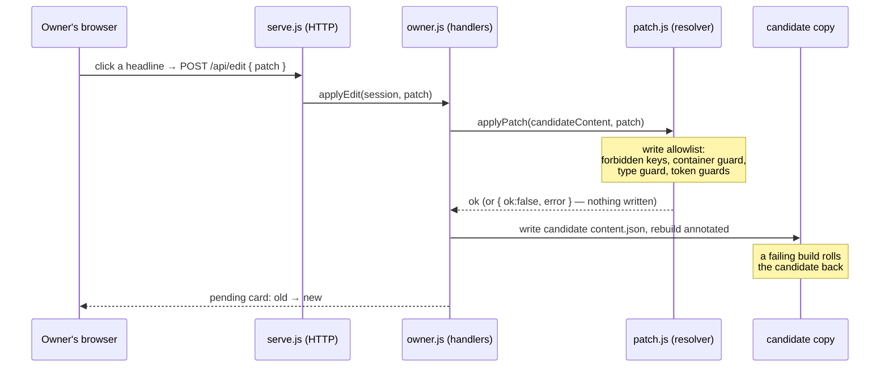
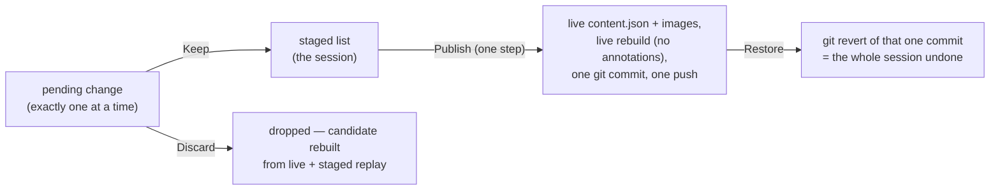

# Chapter 1 — The system map

*This is the top-down door into the guide. If you'd rather start from a
single concrete function and zoom out, jump to
[Trace A](03-traces/trace-a-build.md) instead — both routes are laid out in
the [README](README.md).*

## What Blockson is, in one paragraph

Blockson is a **static site generator**: a program that reads a description
of a website from a data file and writes out finished HTML files that any
cheap web host can serve. One engine serves many client sites — each
client's entire website lives in a single `content.json` file plus a folder
of images. What makes Blockson different from the generators you may have
heard of (Jekyll, Hugo, Eleventy) is its second half: a built-in,
deliberately limited **owner editor** that lets a non-technical business
owner click on their own site, change words and pictures, preview the
result, and publish — while making it *mechanically impossible* for them to
break the layout, inject a script, or otherwise disrupt the intended design. The developer sets
a site up once; the owner maintains it forever without a CMS, a database,
or a hosting bill.

> **Term: static site.** A site whose pages are plain `.html` files made
> ahead of time, identical for every visitor — as opposed to a *dynamic*
> site that assembles each page on a server per request. Static files are
> cheap to host, fast, and have almost no attack surface.

## Map 1 — The build data flow

This is what happens when a developer runs
`node engine/build.js <client>`. The full keypress-to-files story is
[Trace A](03-traces/trace-a-build.md); this is the satellite view.



The two non-obvious rules, both visible in `engine/build.js`:

1. **Validation happens before any file is written.** If `content.json`
   fails the schema, the process exits and `dist/` is untouched.
2. **There are no partial builds.** Every page is rendered into memory;
   only then is `dist/<client>/` wiped and rewritten. You can never catch
   the output directory half-old, half-new.

> **Term: schema.** A formal, machine-checkable description of what shape a
> piece of data must have — which fields exist, their types, what's
> required. Blockson's is a *JSON Schema* file checked by the `ajv`
> library; see the [validation chapter](02-atlas/03-validation.md).

## Map 2 — The owner-edit lifecycle

This is what happens when the business owner clicks a headline in the
editor served by `node engine/serve.js <client>`. The full story is
[Trace B](03-traces/trace-b-owner-edit.md).





The key vocabulary, used everywhere in this guide:

| Term | Meaning here |
|---|---|
| **patch** | A small JSON instruction like `{ "action":"set", "block":"home-hero", "field":"headline", "value":"…" }` — the only language in which content changes can be expressed. |
| **resolver** | `applyPatch` in `engine/lib/patch.js` — the single function every content write passes through, which enforces the write allowlist. |
| **candidate** | A full working copy of the client (`clients/<name>__candidate/`, never committed) that edits are applied to. The owner's preview *is* a real build of this copy — nothing is mocked. |
| **pending change** | The one change just made, shown as an old → new card; not yet kept. |
| **staged list / session** | Changes the owner has Kept. They live in memory until one Publish ships them all. |
| **live** | `clients/<name>/` — the real site source. Only Publish (and Restore) ever writes here. |
| **annotated build** | A preview-only build where every editable element is stamped with `data-bk-*` attributes so the editor knows what's clickable. Live builds never contain these. |

## Map 3 — Directory anatomy

Who owns what. **Engine** = code the developer maintains; **client** =
per-site data; **generated** = build products you can always throw away.

```text
engine/                      ENGINE — all the code
  build.js                     build entry point (--annotate for previews)
  serve.js                     owner-editor HTTP server (localhost)
  apply-patch.js               patch CLI (backup → patch → rebuild → rollback)
  sitemap.js / new-client.js   edit-map printer / client scaffolder
  validate-blueprint.js        \ acceptance CLIs for the two
  validate-theme.js            / authoring kits
  _run-proofs.js               the 20-proof test suite
  blocks/                      one module per block type (21) + _registry.js
  partials/                    head.js, nav.js, footer.js
  lib/                         the core: validate, render, escape, patch,
                               sitemap (edit map), annotate, owner, scaffold
  schema/content.schema.json   the contract between data and engine
  ui/                          the editor app (index.html, ui.js, overlay.js)

blueprints/                  ENGINE-ADJACENT — developer-authored JSON layouts
                             owners may instantiate (pages, sections, items)

themes/                      ENGINE-ADJACENT — tokens.json per theme;
                             default/ also carries the shared css/ and js/

clients/                     CLIENT DATA — one folder per site
  <name>/content.json          the whole site as data
  <name>/img/                  the site's images
  <name>/owner-config.json     editor config (publish command, port…)
  <name>/edits.log.jsonl       maintenance ledger (gitignored)
  <name>__candidate/           GENERATED — editor working copy (gitignored)

dist/                        GENERATED — build output (gitignored)
  <name>/                      live build — deployable
  <name>__annotated/           preview build — never deploy
  <name>__candidate__annotated/  the owner editor's preview
```

A useful habit when meeting any production codebase: sort every directory
into *code I'd edit*, *data the code reads*, and *artifacts I can delete*.
Blockson makes the third category explicit by gitignoring all of it.

## The two-tier trust model — a design decision you can imitate

Blockson splits every human who will ever touch a site into exactly two
roles, and gives each a different *mechanical* power level:

| Tier | Who | Tooling | Can |
|---|---|---|---|
| **Setup** | the developer | full repo, any editor | change anything: engine code, schema, themes, blueprints, content structure |
| **Maintenance** | the owner | the click-to-edit editor (or a raw patch) | change *values* inside existing fields, toggle section visibility, adjust 6 allowlisted brand-color tokens, and instantiate developer-blessed blueprints |

The split is enforced in code, not in documentation. Every maintenance-tier
write — no matter whether it came from the UI, the CLI, or some future
automation — funnels through one function, `applyPatch` in
`engine/lib/patch.js`, which refuses anything outside the allowlist:
structural keys (`id`, `type`, `slug`), whole containers, theme tokens off
the safe list, values of the wrong type. Structural additions get their own
separately guarded path (`engine/lib/scaffold.js`), which only instantiates
blueprints a developer wrote and shipped.

Why design it this way? Three reasons worth stealing for your own projects:

1. **Asymmetric consequences.** The developer can recover from any mistake
   (it's all in git); the owner can't. So the owner's tier is shaped so
   that the *worst possible* action is ugly, never broken. The repo's
   tutorial states the trade as a slogan: *a wrong write that lands is a
   safety failure; a rejected action is just a UX cost.*
2. **One chokepoint beats many checks.** Because every write passes through
   `applyPatch`, a guarantee proved about that one function ("you cannot
   replace an array", "you cannot write `themeOverrides` without the format
   guards") holds for every caller — present and future. Scattered
   per-caller checks drift; a single resolver cannot.
3. **The allowlist is derived, not duplicated.** The editor's clickable
   surface comes from the same edit map (`engine/lib/sitemap.js`,
   `buildEditMap`) the resolver's surface is derived from, so the UI can
   never offer an edit the engine would refuse, and the engine can never
   quietly accept more than the UI shows. When two things must agree,
   generate both from one source.

The classroom version of this idea is "validate user input." The
production version is: *decide who is trusted to do what, route every
action through a gate that enforces it, and prove the gate with tests*
(the proof suite — see [chapter 12](02-atlas/12-testing-proofs.md)).

---

**Where next?**
- Top-down route: continue to the concept atlas, starting with
  [modules](02-atlas/01-modules.md).
- Want to watch the machine actually run? Jump into
  [Trace A](03-traces/trace-a-build.md).
- Workflow-shaped walkthroughs (with screenshots) live in
  [docs/tutorial/developer/](../tutorial/developer/README.md) and
  [docs/tutorial/owner/](../tutorial/owner/README.md).
