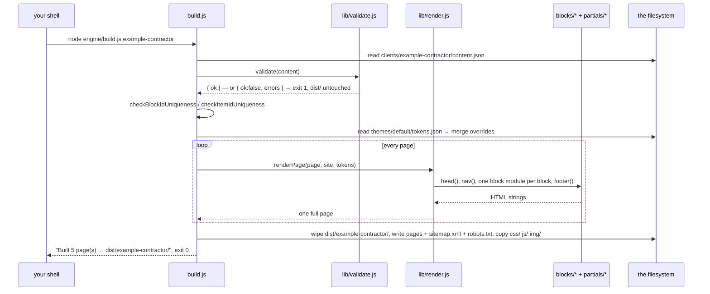

# Trace A — `node engine/build.js <client>`, from keypress to `dist/`

*This is the detail-first door into the guide. We follow one command
through every file it touches. Have the repo open beside this; each stop
names the file and function so you can read along. (Top-down learners
arriving from the [system map](../01-system-map.md): this is Map 1 at
ground level.)*

The command we trace:

```
node engine/build.js example-contractor
```

## The route at a glance



## Stop 1 — `engine/build.js`, top of file

You are at the entry point, because `node` runs exactly the file you name.
The first working lines anchor and parse:

```js
const ROOT    = path.resolve(__dirname, '..');
const args    = process.argv.slice(2);
const annotate = args.includes('--annotate');
const clientName = args.find(a => !a.startsWith('--'));
```

`ROOT` is the repo root, computed from the *file's* location, not your
shell's — so the command works from any directory
([atlas 04](../02-atlas/04-files-and-paths.md)). `clientName` is
`"example-contractor"`; `annotate` is `false`, which makes `distSuffix`
the empty string — this is a live build
([atlas 05](../02-atlas/05-cli-arguments.md) for the argument idioms).

Then the first read, wrapped in the first failure gate:

```js
content = JSON.parse(fs.readFileSync(contentPath, 'utf8'));
```

If the JSON is malformed, the `catch` prints the parser's message and
exits 1. Nothing downstream ever sees broken data.

## Stop 2 — `engine/lib/validate.js`, in `validate()`

You are here because `build.js` calls `validate(content)` before doing
*anything* else with the data — the schema is the contract between data
and engine ([atlas 03](../02-atlas/03-validation.md)).

`loadSchema()` reads `engine/schema/content.schema.json` (cached in the
module-level `_schema`), then ajv checks the whole document with
`allErrors: true`. On failure, `formatErrors` rewrites ajv's output into
sentences like `pages.0.meta.description is required`, and back in
`build.js`:

```js
if (!result.ok) {
  console.error('Validation failed:');
  result.errors.forEach(e => console.error(`  ✗ ${e}`));
  process.exit(1);
}
```

**This is the failure path the trace promised.** Note what *didn't*
happen: no file was written, no directory wiped. `dist/` still holds the
previous good build. Try it yourself in Phase-4's exercises — break one
field in a scratch client and watch the build name it exactly.

Back in `build.js`, two checks the schema language can't express run
next: `checkBlockIdUniqueness` and `checkItemIdUniqueness`, because block
and item ids are the patch system's addressing scheme
([atlas 02](../02-atlas/02-json-data-model.md)) and duplicates would make
addresses ambiguous.

## Stop 3 — `engine/build.js`, theme resolution

Still in `build.js`, because the renderer needs tokens before it can
write a `<head>`:

```js
const preset = JSON.parse(fs.readFileSync(tokensPath, 'utf8'));
resolvedTokens = { ...preset, ...(site.themeOverrides || {}) };
```

The theme's `tokens.json` merged with the client's overrides — overrides
last, so the client wins. One object now carries every design decision
as `name → value`.

## Stop 4 — `engine/lib/render.js`, in `renderPage()`

You are here because `build.js` loops `for (const page of content.pages)`
and calls `renderPage(page, site, resolvedTokens, annotator)` — with
`annotator` set to `null`, since this is a live build (the preview-build
story is told in [Trace B](trace-b-owner-edit.md)).

`renderPage` assembles a page as an array of strings:

```js
parts.push(head(page, site, tokens));
parts.push('<body>');
parts.push(nav(site, page.slug));
for (const block of page.blocks) {
  const mod = BLOCKS[block.type];
  ...
  if (hidden && !annotator) continue;
  ...
  let html = mod(block.fields, site, bk);
```

Three things to watch:

- `BLOCKS[block.type]` — data selecting code via the registry
  ([atlas 01](../02-atlas/01-modules.md)). An unknown type throws, which
  `build.js` catches per-page and turns into exit 1.
- `hidden && !annotator` — a block whose `fields.hidden` is `true` is
  simply skipped in live builds. Owners hide sections without deleting
  them.
- `bk` is `NOOP_BLOCK` here: every annotation call inside block modules
  returns `''`, so live HTML is byte-identical to a world where the
  editor doesn't exist.

## Stop 5 — `engine/blocks/hero.js` (one block, standing for 21)

You are here because the home page's first block has `"type": "hero"`.
The module is one function from fields to HTML:

```js
return `<section class="hero">
  <div class="hero-bg"${bk.f('background')} style="background-image:url('${esc(fields.background)}')"></div>
  ...
  <h1${bk.f('headline')}>${esc(fields.headline)}</h1>
```

`esc(...)` around every value — the five-character escape map from
`engine/lib/escape.js` that keeps content from becoming markup
([atlas 13](../02-atlas/13-security-mindset.md)). `bk.f('headline')`
contributes nothing in this live build; in an annotated build it would
splice ` data-bk-block="home-hero" data-bk-field="headline"` into the
tag. Same template, two outputs, controlled by one parameter.

`engine/partials/head.js` meanwhile wrote the `<head>`: meta tags,
canonical URL, and `buildRootBlock(tokens)` — the resolved tokens
injected as a `:root { --color-primary: #ffb703; … }` style block. This
is how one shared stylesheet serves thirteen themes: the CSS references
`var(--token-name)`; the build supplies the values.

## Stop 6 — `engine/build.js`, the writes

You are back in `build.js` because `renderPage` returned a string and the
loop pushed it onto `outputs`. Only after *every* page rendered — plus a
generated `sitemap.xml` and `robots.txt` — does the write phase start:

```js
if (fs.existsSync(distDir)) {
  fs.rmSync(distDir, { recursive: true, force: true });
}
fs.mkdirSync(distDir, { recursive: true });
for (const out of outputs) {
  fs.writeFileSync(path.join(distDir, out.destPath), out.content, 'utf8');
}
```

Render-everything-first means a crash anywhere above leaves the old
`dist/` intact ([atlas 04](../02-atlas/04-files-and-paths.md)). Then
`copyDir` brings in the theme's `css/`, the shared `js/` (default theme's
as base, theme overrides on top), and the client's `img/`.

The last act is advisory: `warnOnHeavyImages` names any image over
500 KB on stderr, and `warnOnPlaceholderForms` nags about an unconfigured
contact form — warnings, never failures
([atlas 10](../02-atlas/10-error-handling.md)).

```
Built 5 page(s) → dist/example-contractor/
```

Exit code 0. `dist/example-contractor/` is a complete website — open
`index.html` in a browser, or deploy the folder anywhere static files go.

## What to take from this trace

The whole build is a **pipeline with one gate**: parse → validate →
(everything else). Each stage trusts its input only because the stage
before guaranteed it. And the run you just traced is exactly what the
owner editor executes — twice per edit — as its acceptance gate, which is
where [Trace B](trace-b-owner-edit.md) picks up.

**Zooming out from here (PATH 2 readers):** the concepts this trace
stepped through, in reading order —
[modules](../02-atlas/01-modules.md) ·
[JSON as a data model](../02-atlas/02-json-data-model.md) ·
[validation](../02-atlas/03-validation.md) ·
[files & paths](../02-atlas/04-files-and-paths.md) ·
[CLI arguments](../02-atlas/05-cli-arguments.md) ·
[error handling](../02-atlas/10-error-handling.md) — then the
[system map](../01-system-map.md) for the whole picture.

---

## Try it

**Exercise 1 (predict, then verify).** Re-run the trace with your own
hands and a stopwatch on the failure gate. In
`clients/learning-lab/content.json`, set the hero's `"background"` value
to `123` (a number where a string belongs). *Predict:* which stop in
this trace catches it, what does the message say, and does `dist/`
change? Then build.

<details><summary>What you should see</summary>

Stop 2 - `pages.0.blocks.0.fields.background must be string`, exit 1,
`dist/learning-lab/` untouched. The render loop (Stop 4) never ran.
Restore the value and rebuild.</details>

**Exercise 2 (predict, then verify).** *Question:* how do the live and
annotated outputs of the *same content* differ, and by how much? Build
both (`node engine/build.js learning-lab` and again with `--annotate`)
and compare `index.html` from each (with your editor's diff, or count
`data-bk-` occurrences). Predict the count in each before looking.

<details><summary>What you should see</summary>

The only differences are `data-bk-*` attributes spliced into opening
tags (zero in live; one per editable element in the annotated build) -
the `bk.f(...)` calls at Stop 5 returning `''` versus attribute
strings.</details>

**Exercise 3 (modification, safe).** Add a `text` block to the home
page: `{ "id": "home-note", "type": "text", "fields": { "heading": "From the trace", "body": ["One paragraph."], "hidden": false } }`.
Build, view, then set `"hidden": true` and build again. Confirm the
section vanishes from `dist/learning-lab/index.html` but still appears
(dimmed-ready, with `data-bk-hidden`) in the annotated build - the
`hidden && !annotator` line at Stop 4 in action.

## Self-check

1. Put these in execution order: wipe `dist/`, parse JSON, render
   pages, validate schema, copy `img/`.
   <details><summary>Answer</summary>Parse → validate → render (into
   memory) → wipe → write pages → copy img/. The wipe is as late as
   possible on purpose.</details>
2. Which two uniqueness checks run after the schema passes, and why
   can't the schema do them?
   <details><summary>Answer</summary>`checkBlockIdUniqueness` and
   `checkItemIdUniqueness` in `build.js` - JSON Schema can't express
   cross-document uniqueness constraints.</details>
3. Where do the values inside the page's `:root { … }` style block come
   from?
   <details><summary>Answer</summary>`themes/<theme>/tokens.json` merged
   with `site.themeOverrides` (overrides win), injected by
   `buildRootBlock` in `engine/partials/head.js`.</details>
4. Transfer: a teammate proposes writing each page to disk as soon as
   it renders "to save memory." What invariant breaks?
   <details><summary>Answer</summary>All-or-nothing output: a crash on
   page 7 would leave dist/ half-new, half-wiped. The current design
   guarantees the old build survives any failure.</details>
