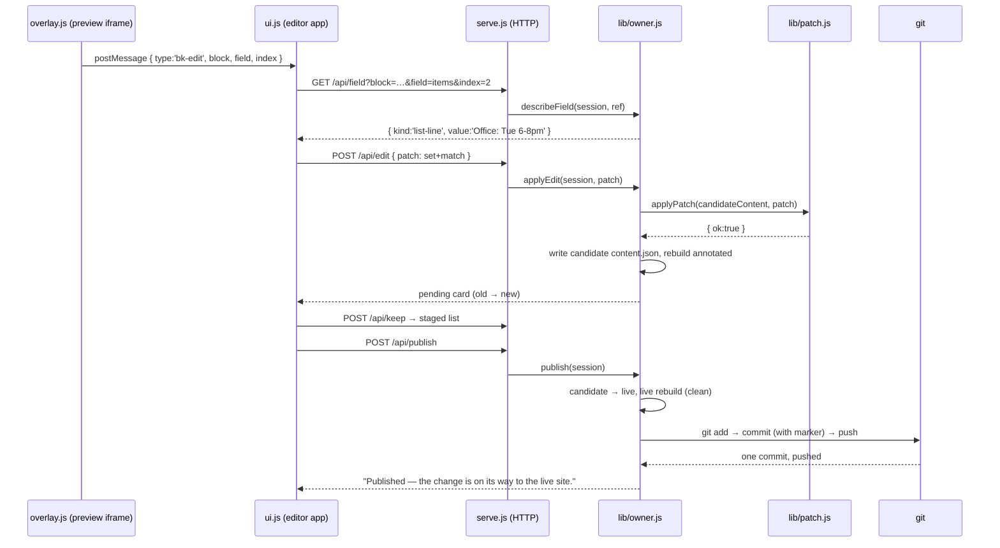

# Trace B — the owner fixes a typo in their hours, from click to `git push`

*Second trace, deeper stack: browser → HTTP → handlers → resolver →
build → git. The scene: the owner has `node engine/serve.js <client>`
running (their developer set it up), the editor is open at
`http://127.0.0.1:4173/`, and the About page's hours say
"Office: Tue 6-8pm" — but office night moved to Wednesday.*

## The route at a glance



## Stop 1 — `engine/ui/overlay.js`, the click

You are in the *preview iframe* — the annotated candidate build with the
overlay script injected at serve time (it exists nowhere on disk;
`sendStatic` in `serve.js` splices the `<script>` tag into HTML
responses under `/preview/`).

The owner clicks the hours line — a `list-panel` block whose `items`
field is a flat list of strings. (Blockson also has a structured
`hours-table` block with id-addressed rows; this site keeps its office
hours as plain lines, which is what makes this trace show the match-form
edit.) The capture-phase click listener walks up with
`closest('[data-bk-block]')` and finds the `<li>` the annotated build
stamped — `engine/blocks/list-panel.js` renders each line with
`bk.l('items', idx)`. It suppresses the page's own behaviour and posts:

```js
window.parent.postMessage({
  type: 'bk-edit',
  block: d.bkBlock,        // "about-hours"
  field: d.bkField,        // "items"
  index: d.bkIndex,        // "2" — third line of the list
  ...
}, ORIGIN);
```

([Atlas 07](../02-atlas/07-dom-and-events.md) unpacks every DOM idiom in
this file.)

## Stop 2 — `engine/ui/ui.js`, in `openEditor()`

You are in the editor app (the parent page) because its `message`
listener — after checking `e.origin` — received `bk-edit` and called
`openEditor(ref)`.

The UI doesn't guess what kind of field this is; it asks:
`GET /api/field?block=about-hours&field=items&index=2`. The server route
calls `describeField` in `owner.js`, which reads the **candidate**
content and reports `{ kind: 'list-line', value: 'Office: Tue 6-8pm' }`.
`openEditor` dispatches on `kind` to `renderLineEditor`, which keeps the
original line and builds the patch from it on Save:

```js
var p = basePatch(ref, 'set');   // { action:'set', block:'about-hours', field:'items' }
p.match = original;              // "Office: Tue 6-8pm" — the EXACT current line
p.value = input.value;           // "Office: Wed 6-8pm"
stage(p, null, ed);
```

Text-list lines are addressed by **matching their current text**, never
by index — an index could be stale; the exact string can't silently hit
the wrong line. `stage()` POSTs it to `/api/edit` with the
`x-blockson-ui: 1` header.

## Stop 3 — `engine/serve.js`, in `handle()`

You are in the HTTP layer because every editor action is a request. The
gauntlet, in order: `requestAllowed` (loopback socket + local `Host`
header), `authorized` (access token/cookie, if configured), then for this
POST the custom-header check — three guards before any routing
([atlas 06](../02-atlas/06-http-server.md),
[atlas 13](../02-atlas/13-security-mindset.md)). Then:

```js
if (pathname === '/api/edit') r = owner.applyEdit(session, body.patch, body.upload || null);
```

`serve.js`'s job ends here; it's plumbing by design.

## Stop 4 — `engine/lib/owner.js`, in `applyEdit()`

You are in the handler layer — the deterministic core the proof suite
tests without a server. In order:

1. **One pending change at a time:** `if (session.pending) return { ok:false, ... }`.
2. Read the candidate's `content.json`, keeping `beforeText` for rollback.
3. Derive the card's "old" value — for a match-form patch, the match
   string itself.
4. Hand the patch to the resolver.

Note what `applyEdit` does *not* do: trust the UI. The patch came from
Blockson's own editor, and it still goes through every guard — "UI input
is untrusted input" (the file's header comment).

## Stop 5 — `engine/lib/patch.js`, in `applyPatch()`

You are at the chokepoint every content write in the system passes
through. For our patch: action is `set` ✓; `value` present and
string ✓; field `items` isn't in `FORBIDDEN_KEYS` ✓; block id resolves
via `indexHosts` ✓. Then the match branch:

```js
if (patch.action === 'set' && typeof patch.match === 'string') {
  ...
  const idx = arr.indexOf(patch.match);
  if (idx === -1) return { ok: false, error: `no list item equal to match "${patch.match}"` };
  arr[idx] = patch.value;
  return { ok: true, action: 'set' };
}
```

The content object now carries "Office: Wed 6-8pm". Nothing is on disk
yet.

**How a bad change dies here:** suppose the patch had tried
`field: "type"` (forbidden key), or `field: "items"` with no value, or
targeted a whole array. Each gets `{ ok:false, error }` from a specific
guard, `applyEdit` returns that error verbatim, the editor pane shows
it — and the candidate file was never written. The proof suite slams this
door repeatedly (proofs 3, 6, 7).

## Stop 6 — back in `applyEdit()`: the acceptance gate

The mutated content is written to the candidate's `content.json`, then:

```js
const b = buildCandidate(session);
if (!b.ok) {
  fs.writeFileSync(candContentPath(session), beforeText, 'utf8');
  ...
  buildCandidate(session); // restore the preview to the last good state
  return { ok: false, buildFailed: true, error: `That change did not pass the site's checks...` };
}
```

`buildCandidate` runs **Trace A** as a child process — annotated, against
the candidate. The schema, the id checks, every block renderer: all of it
re-judges the edit. A resolver can only check what a patch *says*; the
build checks what the site *becomes*. If it fails, the rollback restores
the previous candidate bytes and rebuilds the preview, so even the iframe
never shows a broken page.

On success, `session.pending` is set: patch, old, new, and a summary
("edit a line in about-hours.items"). The response reaches `ui.js`, which
re-fetches `/api/state`, shows the **pending card** ("Now: Office: Tue
6-8pm / After: Office: Wed 6-8pm"), and reloads the iframe — the owner is
looking at a real build of their edited site.

One more thing happened invisibly: `applyEdit` is exported through the
`logged(...)` wrapper, so one JSONL line — timestamp, the patch, the
outcome — was appended to `clients/<client>/edits.log.jsonl`
([atlas 10](../02-atlas/10-error-handling.md) explains why a ledger
failure there would be deliberately swallowed).

## Stop 7 — Keep, then Publish

The owner clicks **Keep**: `POST /api/keep` → `owner.keep(session)` moves
the pending change onto `session.staged` (with a `replay` record — if a
later pending change is discarded, the candidate is rebuilt from live
plus a deterministic replay of this list, never by trying to invert a
patch). Keep touches no files; live is still untouched.

The owner clicks **Publish 1 change**: `POST /api/publish` →
`owner.publish(session)`:

1. Refuses if anything is still pending.
2. Backs up live `content.json`, copies the candidate's over it, copies
   any session-uploaded images.
3. `buildLive(session)` — Trace A again, *without* annotations. (A
   failure here "should be impossible" — the same content just built as
   the candidate — and is still handled with a full rollback.)
4. `runPublish(session, summary)` — the git automation.

## Stop 8 — `engine/lib/owner.js`, in `runPublish()`

You are at the boundary where the system drives another program
([atlas 11](../02-atlas/11-git-automation.md)):

```js
const add = git(['add', '--', ...toAdd]);          // only this client's content.json + img/
const commit = git(['commit', '-m', message]);     // "Site update (client): edit a line in about-hours.items [blockson-publish client]"
const push = git(['push']);
```

One commit for the whole session, carrying the `[blockson-publish
<client>]` marker that `restore()` would grep for if the owner ever
clicks "Undo last publish" — which would `git revert` this exact commit,
rebuild, and push again. The static host (GitHub Pages, Netlify…) sees
the push and redeploys. The owner sees:

> Published — the change is on its way to the live site.

## What to take from this trace

Count the judges one typo faced: the header guard, the pending-change
interlock, the resolver's allowlist, the schema, the full candidate
build — and only then a human clicking Keep and Publish. Every gate is
the *same code* for every caller, every failure rolls back to a good
state, and the happy path's cost is two rebuilds of a site that builds in
under a second. That's the trade the whole system makes: machine time is
cheap; broken-live-sites are not.

**Zooming out from here:** [the HTTP server](../02-atlas/06-http-server.md) ·
[DOM & events](../02-atlas/07-dom-and-events.md) ·
[error handling](../02-atlas/10-error-handling.md) ·
[git automation](../02-atlas/11-git-automation.md) ·
[the security mindset](../02-atlas/13-security-mindset.md) — and the
owner's-eye view of this same flow, with screenshots, in
[docs/tutorial/owner/](../../tutorial/owner/README.md).
