# Blockson: the developer workflow, end to end

This is a walkthrough of the **setup tier** — what you, the developer, do
exactly once per client: verify the engine, scaffold a site, author its
content, survive the validation gate, and hand a locked-down editor to the
business owner. It was produced by actually doing it: every screenshot and
terminal transcript here comes from building **Wren & Willow Hair Studio**,
a fictional six-chair salon in Edmonton, with the real tooling. Nothing is
mocked.

One idea organizes everything you're about to read: **a wrong write that
lands is a safety failure; a rejected action is just a UX cost.** Blockson
spends your setup-time freedom buying the owner's long-term safety. Most
of the "why" questions below resolve to that trade.

> Companion docs: [README.md](../../../README.md) (engine overview),
> [BLOCK_CATALOG.md](../../../BLOCK_CATALOG.md) (every block's fields),
> [OPERATOR.md](../../../OPERATOR.md) (hosting + handover),
> [BLUEPRINT_AUTHORING.md](../../../BLUEPRINT_AUTHORING.md) (blueprints).

---

## 1. Clone, install, prove

```
git clone <your repo>
cd blockson
npm install
node engine/_run-proofs.js     # or: npm test
```

`npm install` brings in exactly two runtime dependencies (`ajv`,
`ajv-formats` — the JSON Schema validator). Everything else in the engine
is Node stdlib. Then run the proof suite before you build anything:

```
═══ PROOF 1 — Live build hides ids & annotations; annotated build covers every editable field ═══
PASS — live HTML carries no ids and no data-bk-*; annotated builds stamp every
       editable field the edit map reports (315 required annotations across
       3 clients) and stamp nothing the map does not report.
   …
═══ PROOF 19 — Item blueprints: owners add and remove repeating items through the scaffolder ═══
PASS — the four shipped item blueprints validate; …

════════════════════════════════════════════════════════════
19/19 proofs passed.
```

*(Full transcript: [term/01-proofs.txt](term/01-proofs.txt).)*

**Why this comes first:** the proofs are not unit tests — they are the
*contract*. Each one exercises a safety property end-to-end: the patch
resolver rejects structural writes, live HTML never carries editing
annotations, the editor server refuses foreign hosts, one publish equals
one git commit. If these are green, the guarantees you're about to promise
a client actually hold on your machine.

---

## 2. Scaffold the client

Each business is a *client*: one folder under `clients/` holding a single
`content.json` and an `img/` folder. The engine is shared; the client
folder is the only bespoke thing. Scaffold it:

```
$ node engine/new-client.js demo-scratch trades
Created clients/demo-scratch/ on theme "trades".
Next steps:
  1. Add images to clients/demo-scratch/img/ (logo-white.png, logo-black.png, favicon.png, banner.jpg)
  2. Edit clients/demo-scratch/content.json (see BLOCK_CATALOG.md for all 21 block types)
  3. node engine/build.js demo-scratch
```

The second argument picks one of the 13 theme presets. For the salon we
ran:

```
node engine/new-client.js wren-and-willow salon
```

You get a *minimal but already schema-valid* `content.json` — a homepage
and a contact page — so you are never editing from a blank file, and the
build is green from minute one.

**Why themes are this cheap:** a theme preset is just a flat token map
(`themes/salon/tokens.json` — fonts, colors, radius) injected into every
page as CSS custom properties over one shared stylesheet. Picking
`salon` restyled the entire block catalog with zero CSS work. Font stacks
are self-contained system stacks: built sites load **no CDN fonts, no
remote anything** — local-first is an invariant, not a preference.

---

## 3. Author the content

This is the real work. `content.json` is the whole site as data: a `site`
object (name, contact, nav, footer) and a `pages` array, each page a list
of **blocks** chosen from the [21-type catalog](../../../BLOCK_CATALOG.md).
A hero block from the salon's homepage:

```jsonc
{
  "id": "home-hero",            // ← stable handle; never rendered into HTML
  "type": "hero",               // ← one of the 21 registered block types
  "fields": {
    "tag": "Edmonton · 124 Street",
    "headline": "Hair that still looks good three weeks from now.",
    "subhead": "We're a six-chair studio that books real consultation time…",
    "background": "img/banner.jpg",     // ← always relative to the client's img/
    "actions": [                        // ← no ids = structural = yours alone
      { "label": "Book an Appointment", "href": "https://book.wrenandwillow.ca", "style": "primary" },
      { "label": "See Our Work",        "href": "gallery.html",                  "style": "secondary" }
    ],
    "hidden": false               // ← the owner's hide/show toggle for this section
  }
}
```

Three details deserve attention, because they're load-bearing:

- **Every repeating item carries an `id`** (`"id": "plan-balayage"`,
  `"id": "member-maren"`). Those ids are the *owner's editing handles*:
  "the balayage is $230 now" becomes one id-addressed patch later. Ids
  never appear in rendered HTML (a proof enforces it). Arrays *without*
  ids — hero actions, form fields, gallery filters — are structural by
  design: frozen for the owner, editable only by you.
- **Every `href` is scheme-checked at build time** (`https`, `http`,
  `mailto:`, `tel:`, `sms:`, `#anchor`, or relative). `javascript:` and
  `data:` cannot reach a rendered page. You'll watch this gate fire in §5.
- **The structure you write here is what the owner can never change.**
  Adding, removing, and reordering blocks is exactly the power being
  sealed off at handover — so get the bones right now.

An id-bearing item from the services page, for contrast:

```jsonc
// pricing-table → plans[]: everything the owner will someday need to
// tweak ("the balayage went up") is a scalar on an id-carrying item.
{
  "id": "plan-balayage",
  "name": "Full Balayage",
  "price": "from $210",          // plain string — the engine never does math
  "description": "Hand-painted, lived-in colour designed to grow out for months, not weeks.",
  "features": ["Custom formulation", "Toner and gloss included", "Style and finish"],
  "featured": true               // booleans are developer-only territory
}
```

### Images, the local-first way

The build copies `clients/<name>/img/` verbatim and fetches **nothing**.
For this demo every asset — logos, favicon, hero banner, team portraits,
gallery and before/after art — was generated locally on the theme palette
by [`scripts/generate-demo-images.js`](../../../scripts/generate-demo-images.js)
(seeded SVG compositions rendered with sharp; deterministic, so
regeneration is byte-stable). For a real client you'd use their
photography; the constraint that matters is the same: if it's not in
`img/`, it's not on the site. Oversized files don't fail the build — a
weight advisory names any image over 500 KB on stderr with a one-line fix.

### One page from a blueprint

Four of the salon's five pages were written by hand. The contact page was
deliberately **instantiated from a blueprint** — the same
`blueprints/contact-page.json` the owner could later use from their
editor's "Add…" menu — via the scaffolder API
([`scripts/scaffold-contact-page.js`](../../../scripts/scaffold-contact-page.js)):

```js
const scaffold = require('../engine/lib/scaffold');

const result = scaffold.instantiate(content, bp, 'withForm', {
  menuLabel: 'Contact',
  title: 'Get in touch',
  intro: 'Call, email, or send us a message — we reply within one business day, usually faster.',
  address: '10318 124 Street NW, Edmonton',
  formAction: 'https://UNCONFIGURED',
});
```

```
Created page "contact" (contact.html) with blocks:
  contact-header
  contact-info
  contact-form
Nav entry appended: Contact
```

**Why bother, when you can write JSON by hand?** Because the scaffolder —
not you — owns slug generation, nav wiring, and site-wide id uniqueness
(collision-proof under repeated instantiation; proof 9 hammers it 12×).
And because it demonstrates the structural story you'll tell the client:
the *only* structure an owner can ever add is a blueprint you blessed,
through exactly this code path, validated twice (inputs against the
blueprint's form schema, result against the full content schema).

**Why `formAction` is `https://UNCONFIGURED`:** the contact form needs an
endpoint, and that choice is per-host (Netlify's native forms, the
Cloudflare Worker in `extras/`, or any `https://` relay — see
[OPERATOR.md §8](../../../OPERATOR.md)). The documented placeholder passes
the schema's `https://` guard so form delivery never blocks a build or a
handover — but every build *warns* until it's real. Warn-don't-fail is a
deliberate piece of design: the gate hard-fails only on what would be
unsafe or broken, and nags on what's merely unfinished.

---

## 4. Build

```
node engine/build.js wren-and-willow
```

Output lands in `dist/wren-and-willow/` — complete static HTML, one file
per page, plus `css/`, `js/`, `img/`, `sitemap.xml`, `robots.txt`.
Deployable to any static host as-is.

**Why `dist/` is gitignored:** the repo holds *source* — `content.json`,
tokens, the engine. The host runs the build (`npm install && node
engine/build.js wren-and-willow`, publish directory
`dist/wren-and-willow`). That's the loop that makes owner edits go live
later with no manual deploy: editor pushes `content.json` → host rebuilds
→ site updates. Committing `dist/` would turn every content edit into a
two-place change and eventually a merge conflict between built HTML files.

---

## 5. The gate doing its job

The most instructive moment in the whole workflow is a build that
*refuses*. Suppose someone slips an unsafe link into the hero's actions —
`"href": "javascript:alert(1)"`. The build validates `content.json`
against the JSON Schema **before writing a single file**:

```
$ node engine/build.js wren-and-willow
Validation failed:
  ✗ pages.0.blocks.0.fields.actions.0.href must match pattern "^(?:(?:https?://|mailto:|tel:|sms:|#).*|[^:]*)$"
```

*(Transcript: [term/03-build-fail.txt](term/03-build-fail.txt).)*

Read that error path right to left: `href` of `actions[0]` of `fields` of
`blocks[0]` of `pages[0]` — the exact field, named, nothing written,
`dist/` still holding the last good build. Fix the href, rebuild:

```
$ node engine/build.js wren-and-willow
Built 5 page(s) → dist/wren-and-willow/
  ⚠ The contact form "contact-form" (page "contact") still points at the placeholder
    endpoint https://UNCONFIGURED — submissions will go nowhere until formAction is set
    to a real https:// endpoint or the block is switched to another delivery mode
    (see "Contact form delivery" in OPERATOR.md).
```

*(Transcript: [term/04-build-clean.txt](term/04-build-clean.txt).)*

Both halves of the philosophy in one screen: the unsafe scheme is a
**hard fail** (it could land on a page), the unconfigured form is a
**loud warning** (it's safe, just unfinished). This same gate runs on
every owner edit later — which is why a broken site is not something the
owner can produce.

---

## 6. The built site

Every page, desktop (1440px) and mobile (390px). All of it is the result
of one JSON file meeting one token map.

### Home

| Desktop | Mobile |
|---|---|
| 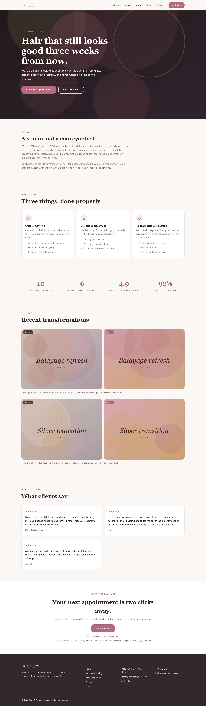 |  |

### Services & pricing — two pricing tables, process steps, FAQ

| Desktop | Mobile |
|---|---|
| 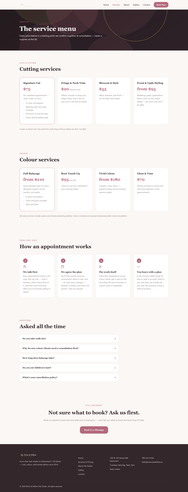 |  |

### About — story, promises, team, hours

| Desktop | Mobile |
|---|---|
| 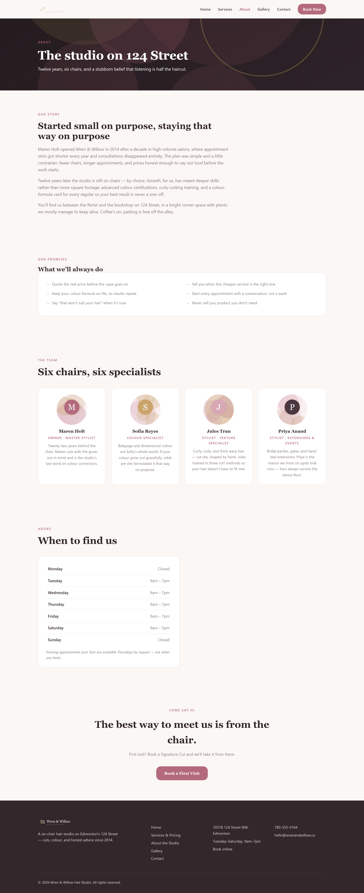 |  |

### Gallery — filterable albums with lightbox

| Desktop | Mobile |
|---|---|
| 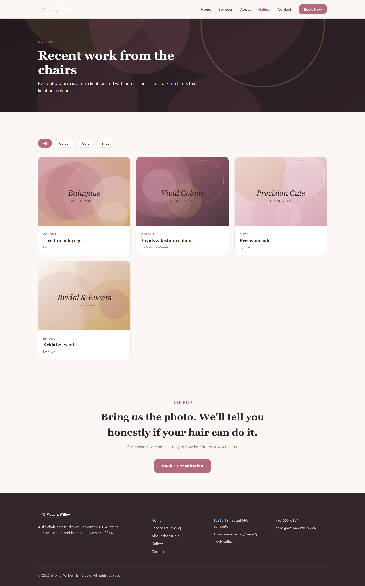 |  |

The lightbox, open (zero of this required configuration — it's the
`gallery` block's stock behavior):

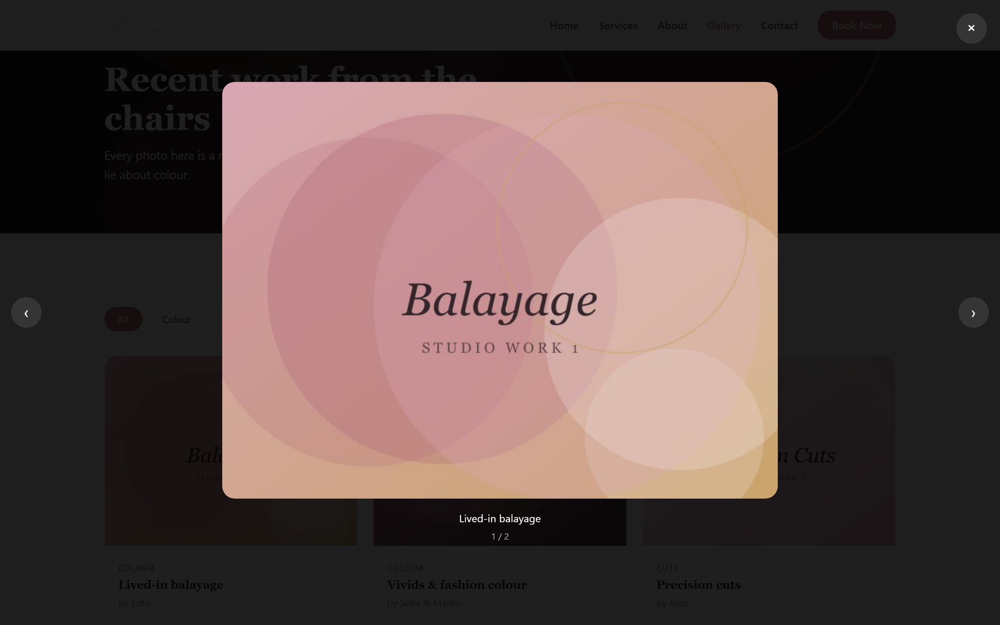

### Contact — the blueprint-instantiated page

| Desktop | Mobile |
|---|---|
| 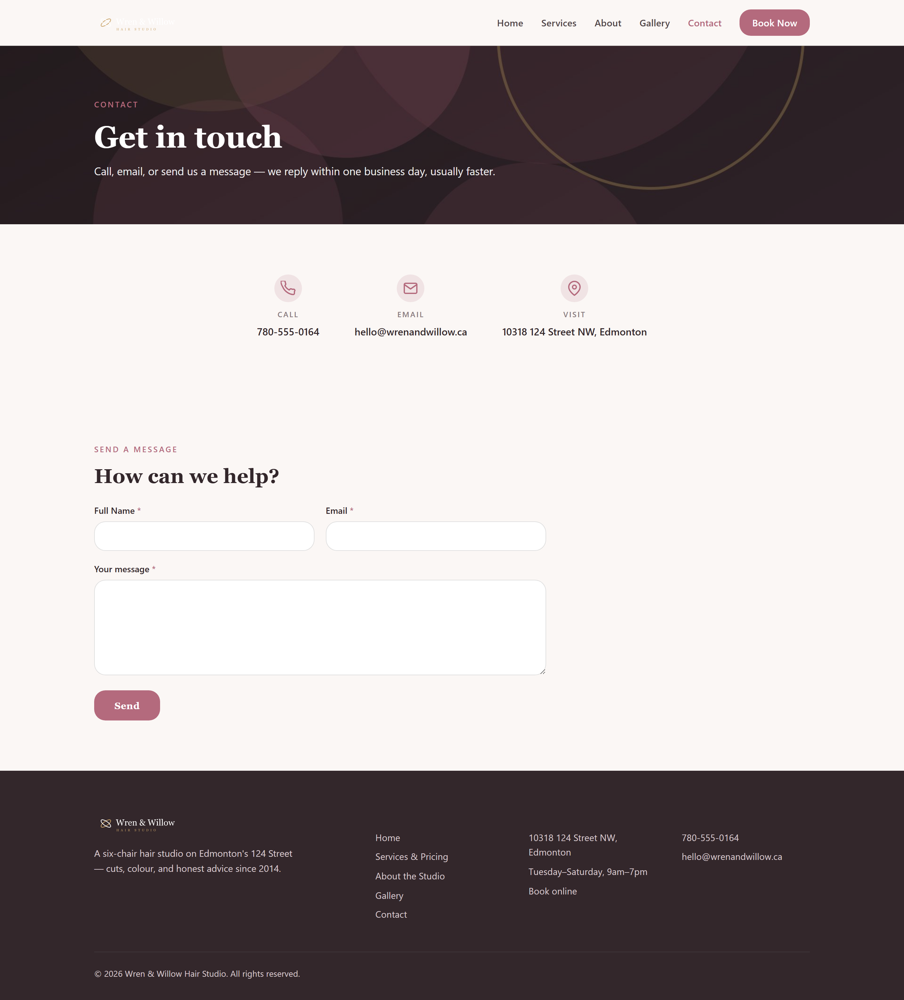 |  |

### Scrolling the homepage

A scroll-through of the homepage, captured as a frame sequence (this
machine has no GIF-capable ffmpeg; with one on PATH, the same harness
step emits a single GIF):


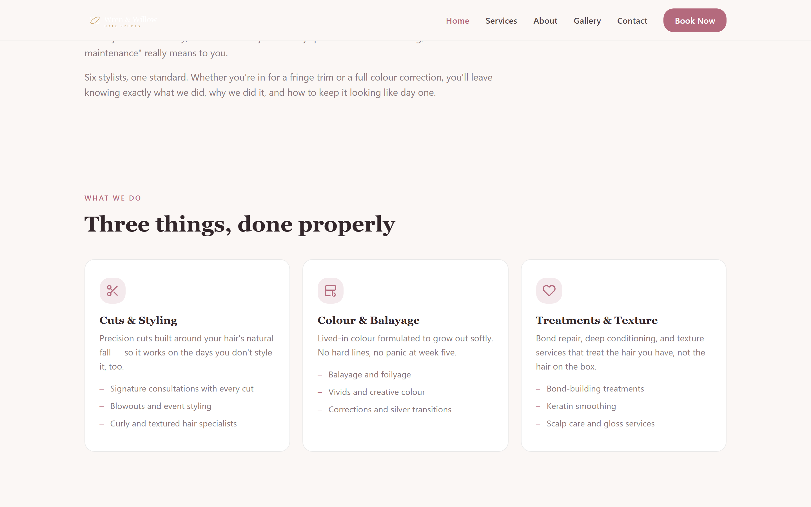
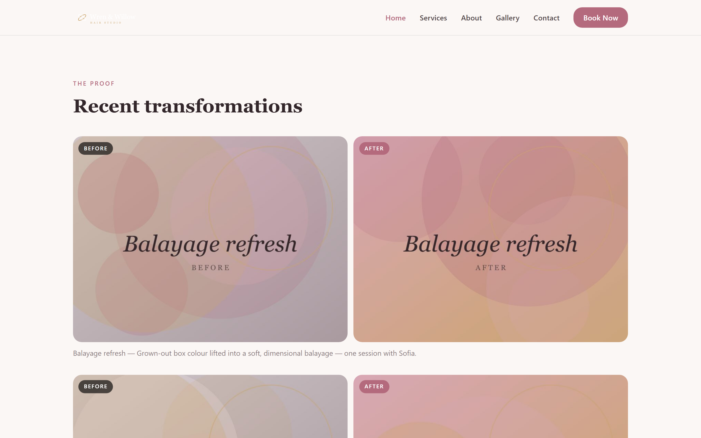
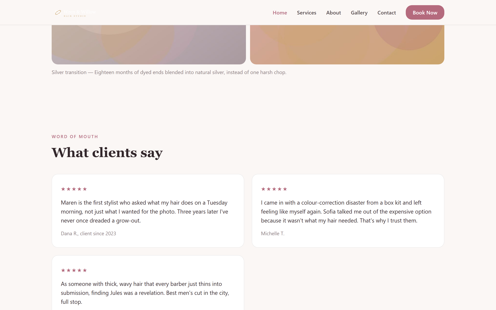
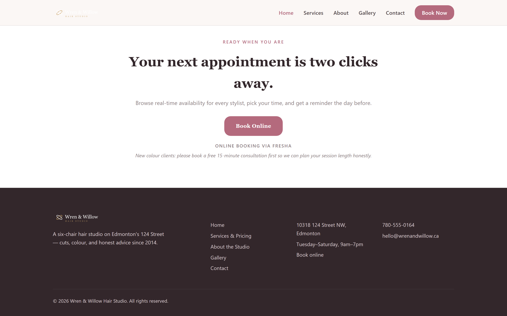

*(Frames f01/f03/f05/f07 omitted here for brevity — all nine are in
[img/](img/), and [img/manifest.json](img/manifest.json) maps every
capture to its step.)*

---

## 7. The edit map — what you're actually handing over

Before handover, look at the site the way the maintenance tier will:

```
$ node engine/sitemap.js wren-and-willow
THEME TOKENS  (brand appearance — edit ONLY with action:"set-token")
  --color-primary  = "#b46a7d"  (color)
  --color-accent  = "#caa46a"  (color)
  …
PAGE index
  block "home-hero" (hero)
    field: tag  = "Edmonton · 124 Street"
    field: headline  = "Hair that still looks good three weeks from now."
    …
```

*(Full map: [term/05-sitemap.txt](term/05-sitemap.txt).)*

This is the **single source of truth for editability** — the same edit
map drives the patch resolver's allowlist *and* the click-to-edit
annotations in the owner's preview, so what the UI offers and what the
engine accepts can never diverge. If a field isn't in this map, the owner
can't touch it; if it is, every write to it still passes the resolver's
guards (type preservation, safe-token allowlist, color format + contrast
checks) and a full candidate build before it can even become a *pending*
change.

---

## 8. Hand off: configure and launch the owner editor

Drop an optional `owner-config.json` in the client folder to set the
display name, the publish behavior (`"git"` = commit-and-push per
session, `"none"` = local only, or a custom deploy-hook command), and who
the owner calls for anything beyond the editor:

```json
{
  "clientName": "Wren & Willow Hair Studio",
  "publish": "git",
  "contact": { "name": "Your Dev", "email": "dev@example.com" }
}
```

Then start the editor:

```
$ node engine/serve.js wren-and-willow
Owner editor for "wren-and-willow"
  → http://127.0.0.1:4173/
  publish: git add/commit/push
```

Loopback-only by default; remote access requires both `--allow-remote`
*and* an access token (the server refuses to start without one). Run it
under any process supervisor — it only needs to be up when the owner
wants to edit; the live site serves from the host regardless.

**Why the owner can't hurt the site from here:** their editor works on a
*candidate* copy (`clients/wren-and-willow__candidate/`, gitignored) —
never the live files. Every change passes the same schema gate from §5
plus the patch resolver, then a full candidate rebuild; only then does it
appear as a pending "old → new" card. They Keep the changes worth
keeping, and one explicit **Publish** ships the whole session to live as
exactly one git commit — which one **Restore** click reverts as a unit.
The dangerous operations aren't forbidden so much as *absent*: there is
no button for them.

---

## 9. What the owner sees next

Where your work ends, this begins — the click-to-edit editor, showing the
salon's candidate preview beside the session panel, brand colors with
their guard-railed pickers, and the "Add a page…" blueprint menu:

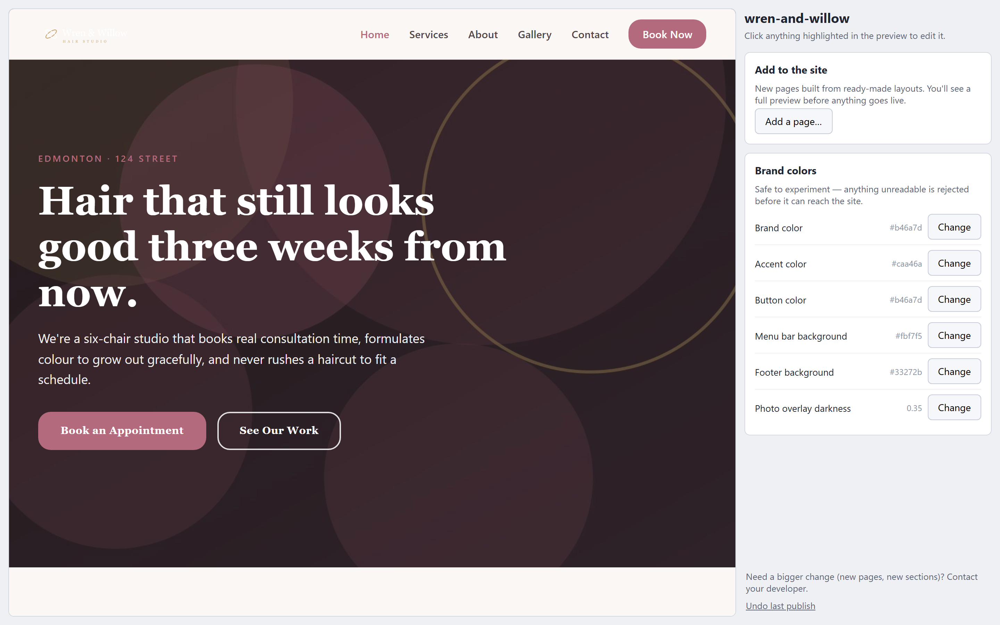

The owner clicks the headline to rewrite it, the hours row to change it,
a photo to replace it (resized and EXIF-stripped in the browser
automatically), and publishes a sitting's worth of edits as one unit.
That whole journey — the pending → Keep → Publish cycle, blueprint pages,
item add/remove, hide/show, and what every refusal message means — is the
**[owner workflow tutorial](../owner/README.md)**. As promised, it cost
exactly one new flow-spec file
([`scripts/flows/owner-editor.js`](../../../scripts/flows/owner-editor.js))
on the same capture harness that produced this document.

---

## Reproducing these captures

```
node engine/build.js wren-and-willow                              # build the demo
node scripts/capture-terminal-snippets.js                         # terminal transcripts → term/
node scripts/capture-tutorial.js scripts/flows/developer-site.js  # screenshots → img/
```

All three are deterministic and leave the working tree as they found it.
