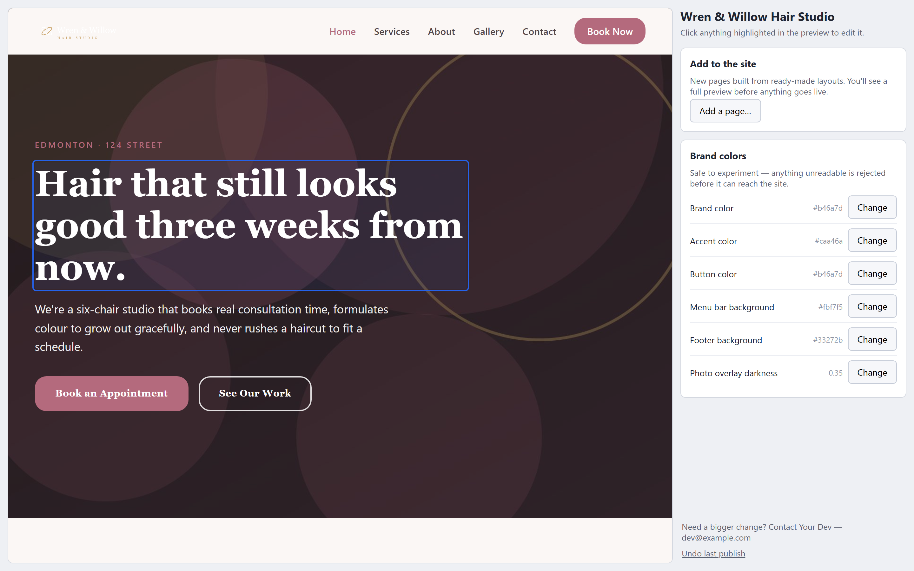
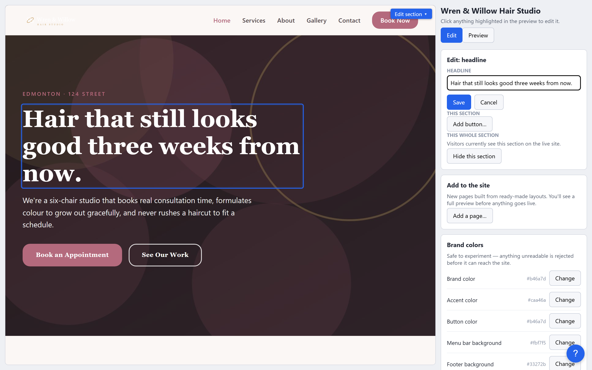
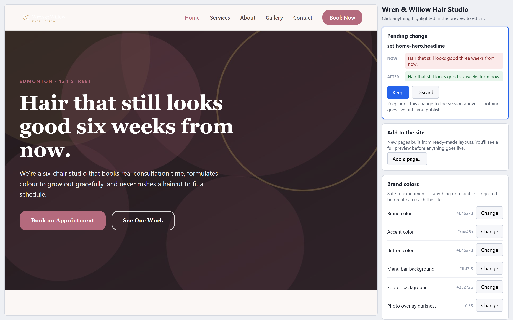
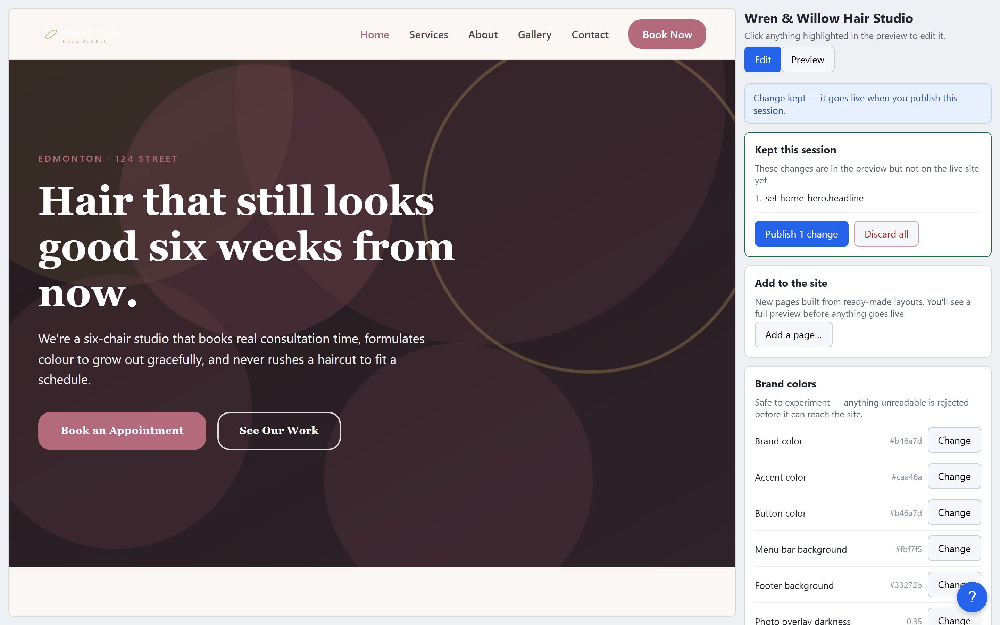
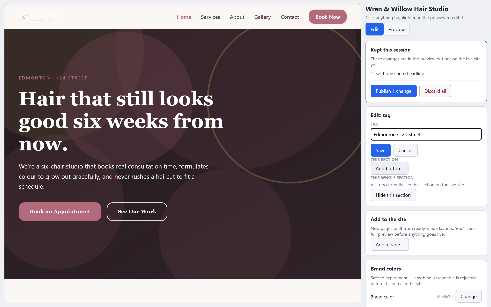
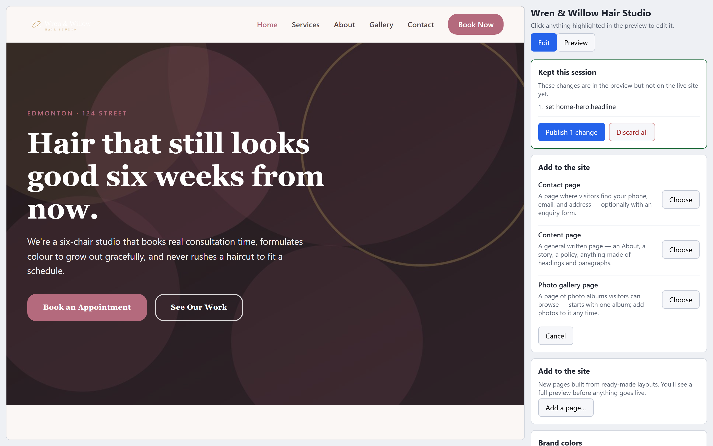
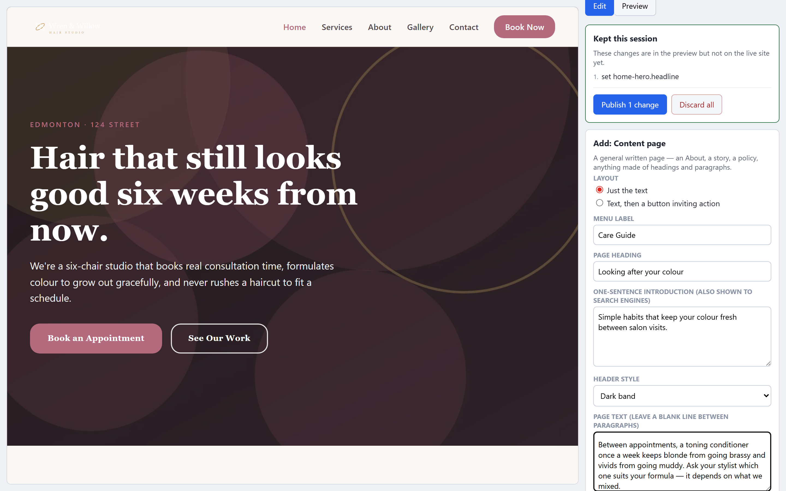
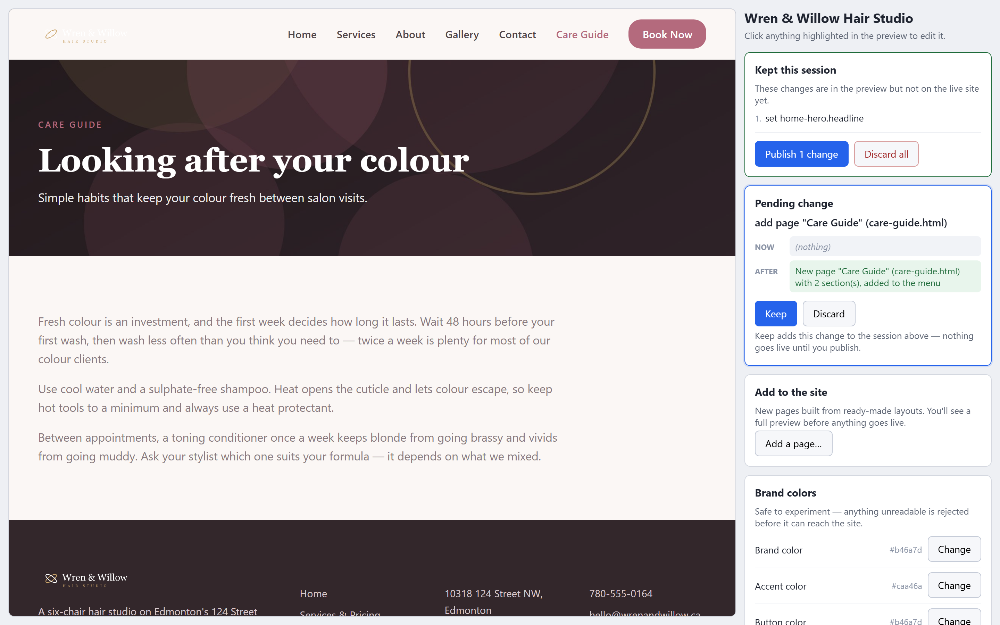
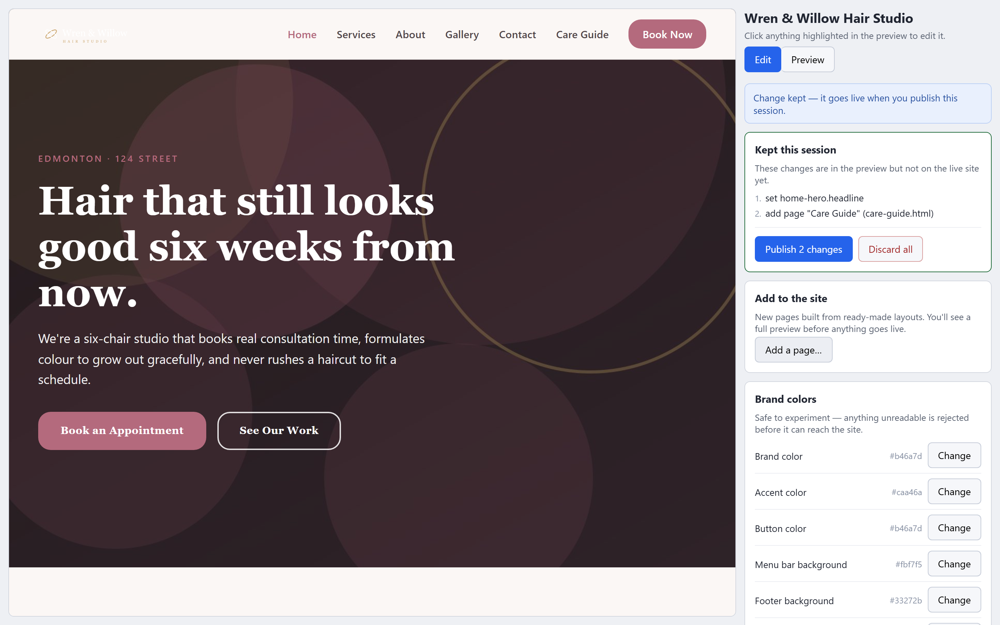
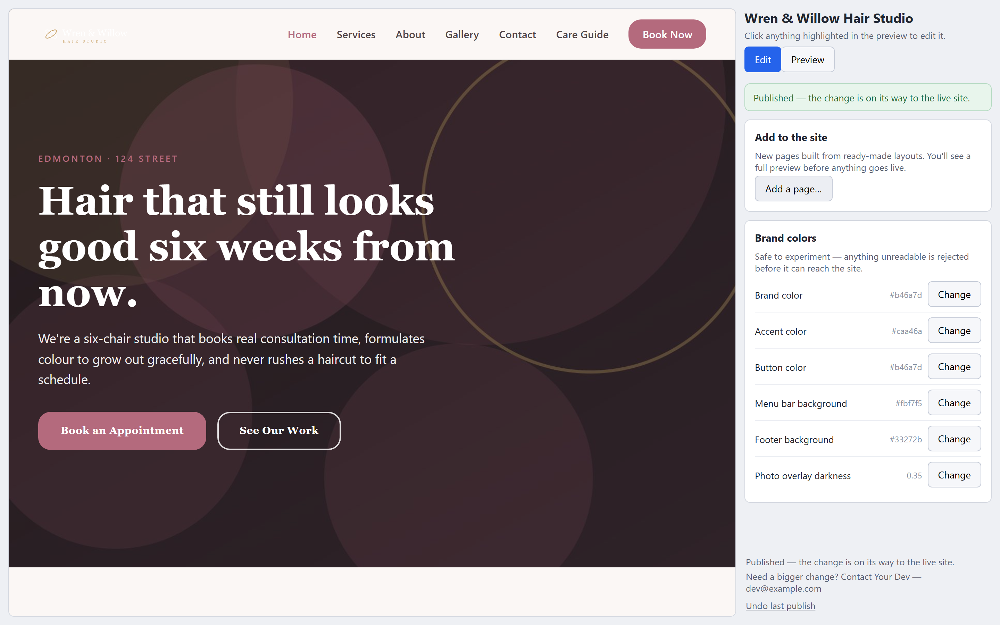

# Editing your own website — a walkthrough

> **❄️ Frozen doc — snapshot, may lag the editor.** This walkthrough's
> screenshots are generated by a Playwright capture harness and are reconciled in
> periodic bundled passes, not on every change — so a picture may show an older
> version of a screen. Pending updates are tracked in
> [`docs/DEFERRED_DOC_UPDATES.md`](../../DEFERRED_DOC_UPDATES.md).

This guide is for the **business owner**. Your developer built your site and
handed you an editor; this is what it does, shown step by step on a real
site — Wren & Willow Hair Studio, a salon in Edmonton. Every picture below
is a genuine screenshot of the editor doing exactly what the text says.

Here is the one idea to hold onto, because everything else follows from it:

> **Nothing you do in this editor touches your live website until you press
> Publish.** You always see a change before anyone else can. And if you
> publish something and regret it, one click brings the previous version
> back.

You cannot break your site from here. The risky operations don't have
buttons — anything the editor offers you is safe to try.

---

## 1. Opening the editor

Your developer gave you a link (and showed you how to start the editor if
it runs on your own computer). Open it in your browser and you'll see two
things side by side:

- **Left:** your website — a private working copy, not the live site.
  Anything you point at lights up with a blue outline: that outline means
  *"you can change this — click it."*
- **Right:** the editing panel — your business name at the top, then the
  tools: a list of changes you've made this sitting, a place to add new
  pages, and your brand colors.

In this picture the mouse is resting on the headline, so the headline is
outlined. Words, prices, photos, opening hours — if it lights up, it's
yours to change.

---

## 2. Click something to change it

Click the headline and an editing box opens in the panel, already holding
the current text:

Type the new wording and press **Save**. (You'll also see options for the
whole section there — like hiding it temporarily — more on that later.)

---

## 3. The "Pending change" card — look before you leap

Saving doesn't change your website. Instead, you get a **Pending change**
card showing exactly what you did, as *Now* (the old text, crossed out)
and *After* (the new). The preview on the left has already updated, so you
can see the new headline in place, in your real design:

The editor handles **one pending change at a time** — it asks you to make
up your mind about this one before starting the next. You have two
buttons:

- **Keep** — yes, I want this; hold onto it.
- **Discard** — no, throw it away.

---

## 4. Keep — your changes pile up safely

Press **Keep** and the change moves up into **"Kept this session"** — a
running list of everything you've decided to keep this sitting. Think of
it as a shopping basket: items in the basket aren't bought yet.

Note the message at the top: *"Change kept — it goes live when you publish
this session."* You can keep editing and pile up as many kept changes as
you like.

---

## 5. Discard — changing your mind is free

Suppose you try a second idea — adding "Walk-ins welcome" to the line
above the headline — then look at the preview and decide against it. Press
**Discard** and it's gone, instantly and completely:

Two things worth noticing in that picture:

- *"Pending change discarded — anything you kept is still staged."* —
  throwing away an experiment never touches the changes you already kept.
  Your headline edit is still safely in the list.
- There's also a **Discard all** button on the session list, which empties
  the whole basket and puts the preview back to exactly what's live —
  the "forget this whole sitting" button.

This is the rhythm of the whole editor: *try it, look at it, keep it or
toss it.* Experimenting costs nothing, because nothing is real until you
publish.

---

## 6. Adding a whole page

You can add new pages yourself — from page layouts your developer prepared
and approved. Press **"Add a page…"** in the panel:

The salon's editor offers a contact page, a photo gallery page, and a
general written page. Choosing **Content page** opens a short form — menu
label, page heading, a one-sentence introduction, and the page text
itself:

Press **Create preview**, and the entire new page appears on the left —
real heading, real text, already added to the site menu — as one pending
change, with the same Keep / Discard choice as ever:

It's still not on your live site. Keep it, and now there are two changes
in the basket — the headline and the new page:

(If a layout you want isn't in the menu — a different kind of page, a new
section on an existing page — that's a job for your developer. The menu
only ever offers layouts they've prepared for your site.)

---

## 7. Publish — everything goes live together

When you're happy with the sitting's work, press **Publish**. Every kept
change — however many there are — goes to your live website **as one
batch**:

*"Published — the change is on its way to the live site."* The session
list is empty again, and your site updates itself from here (give it a
minute or two — your developer can tell you how long yours takes).

Publishing the whole sitting as one batch is deliberate: it means your
visitors never catch the site halfway through your edits, and it makes the
next button possible.

---

## 8. Undo last publish — the regret button

Published something and thought better of it? Press **"Undo last
publish"** at the bottom of the panel, confirm, and the previous version
of your site comes back — the *whole* last batch, undone as one unit:

Look at the preview: the headline is back to the original wording and the
"Care Guide" page is gone from the menu — everything exactly as it was
before that publish. *"The previous version is live again."*

One press undoes the most recent publish. If you need to go back further
than that, ask your developer — the full history of every published
version is kept, nothing is ever truly lost.

---

## What else you can change

The same click-and-look rhythm covers more than text:

- **Photos.** Click any photo, choose a new one from your computer or
  phone. Huge phone photos are shrunk to web size automatically — and the
  hidden location information phones embed in photos is stripped out
  before the picture goes anywhere.
- **Lines in lists.** Opening hours, service areas, "what's included"
  lists — click a line to rewrite or remove it, or add a new one.
- **Repeating items.** Add a new service card, FAQ entry, customer quote,
  or team member — and remove one. (The editor always keeps at least one,
  so a section can never end up empty.)
- **Hiding a section.** Click anything in a section and you'll see *"Hide
  this section"* — useful for, say, the booking banner during your
  holidays. Hidden sections vanish from the live site but stay in your
  preview, dimmed and labelled, so you can bring them back with one click.
- **Brand colors.** The panel lists your site's colors with a picker. It's
  safe to play: any combination that would be hard to read is refused
  before it can reach the site, with an explanation.

Every one of these goes through the same pending → Keep → Publish cycle.
No exceptions — which is exactly why none of them can hurt you.

---

## When the editor says no

Occasionally the editor will refuse something — a color too faint to read,
removing the last item in a section, a page name that's already taken.
When it does, it tells you **why, in plain words**, and nothing about your
site has changed. A refusal is never an error you caused; it's the
guardrail doing its job.

If you keep bumping into a refusal for something you genuinely need,
that's the signal to call your developer — their contact details sit at
the bottom of the panel.

---

## What's yours, and what's your developer's

| You, anytime, yourself | Your developer, on request |
|---|---|
| Edit any text: headlines, prices, hours, names, captions | Add a new *kind* of section the site doesn't have |
| Replace any photo (phone photos are fine) | Reorder sections or menu entries |
| Add, edit, or remove lines in plain lists | Change fonts, sizes, spacing, or layout |
| Add or remove photos in a gallery | Change text colors (they're matched for readability) |
| Add or remove a card, FAQ, quote, or team member | Edit the footer or the contact form's fields |
| Hide a section, and bring it back later | Hide a whole page or menu entry |
| Add pages from the built-in layouts | Add a page that needs a new layout |
| Change brand colors (unreadable ones are refused) | Recover a version older than the last publish |
| Preview everything, keep several changes, publish together | — |
| Undo the last publish in one click | — |

The dividing line is simple: **words and pictures are yours; bones and
style are theirs.** That split is what keeps the site un-breakable from
your side of the table.

---

*For developers: every screenshot above is a real capture of
`engine/serve.js` driving the wren-and-willow demo client — including the
publish and the undo, which ran against a disposable sandbox copy of the
repository with its own throwaway remote, so the full git story
(commit, push, revert) is genuine. Reproduce them with
`node scripts/capture-tutorial.js scripts/flows/owner-editor.js`;
[img/manifest.json](img/manifest.json) maps every file to its step. The
setup tier's side of this handover is the
[developer tutorial](../developer/README.md), and the operational
reference is [OPERATOR.md](../../../OPERATOR.md).*
